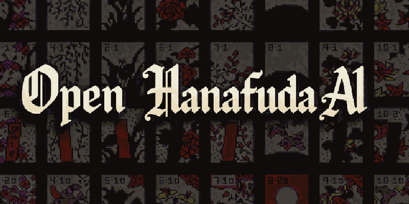

# Open Hanafuda AI [](https://dl.circleci.com/status-badge/redirect/gh/suzukiplan/open-hanafuda-ai/tree/master)



## Overview

This project is motivated by a research-oriented question:

**Can a strong Hanafuda (Koi-Koi) AI be achieved purely through statistical reasoning and simulation, without relying on hidden information or artificial bias?**

In many existing implementations, perceived difficulty is often influenced by non-transparent mechanisms such as biased dealing or access to hidden game state. While these approaches are practical for tuning player experience, they obscure the relationship between decision-making quality and actual AI strength.

From a technical perspective, simulation-based decision-making has historically been constrained by hardware limitations. Techniques such as Monte Carlo evaluation require substantial computational resources, making them impractical for older consoles and arcade systems.

However, with modern CPU performance, it has become feasible to perform large numbers of forward simulations within real-time constraints. This enables a different design approach:

- Treat Hanafuda as a stochastic, imperfect-information game
- Estimate action values through repeated simulation
- Infer hidden state only from observable information
- Combine statistical evaluation with deterministic heuristics

Under this framework, AI strength emerges from the accuracy and efficiency of its inference process, rather than from external adjustments to randomness.

Hanafuda inherently includes a significant degree of chance, making it an interesting domain for studying the balance between stochasticity and decision quality. This project explores how far simulation-based reasoning alone can push competitive performance in such an environment.

By providing this implementation as open source under a permissive license, the project aims to:

- Enable reproducible experiments and comparative evaluation
- Encourage transparent AI design in Hanafuda games
- Serve as a reference implementation for simulation-based decision systems in small decision-space games

Finally, this repository contains an open-source snapshot of the Hanafuda AI simulator used in [Battle Hanafuda](https://store.steampowered.com/app/4161340/Battle_Hanafuda/), bridging experimental design and real-world deployment.

## Coding Rules

### KoiKoi Rules (Nintendo Standard)

As a fundamental principle, the game must be implemented in **full compliance** with the [Nintendo rules for Hanafuda Koi-Koi](https://www.nintendo.com/jp/others/hanafuda_kabufuda/howtoplay/koikoi/index.html) only, and no other local rule variations shall be supported.

This implementation strictly follows the official Koi-Koi rules defined by Nintendo, with no support for local or optional variations.

- **Rounds**
  - A game consists of 12 rounds (January–December).
    - _This implementation allows the number of rounds to be defined as a variable, but a **multiple of 6 rounds (especially 12)** is strongly recommended._
    - _Using a multiple of 6 rounds helps flatten the expected deal distribution, making the outcome depend more on **"Skill"** than on **"Luck"**._
- **Initial Setup**
  - Each player is dealt 8 cards.
  - 8 cards are placed on the table.
  - The remaining cards form the draw pile.
- **Turn Flow**
  - Play one card from hand to the table and capture matching cards if possible.
  - Draw one card from the deck and resolve captures in the same way.
- **Yaku Declaration**
  - When a player forms a yaku, they must choose:
    - **Stop**: End the round and score points.
    - **Koi-Koi**: Continue the round to aim for higher points.
- **Koi-Koi Restriction**
  - Koi-Koi may be declared **only once per round** (no multiple Koi-Koi).
- **Koi-Koi Penalty**
  - If a player declares Koi-Koi and the opponent forms a yaku first:
    - The opponent wins the round.
    - The opponent’s score is **doubled**.
- **Score Multipliers**
  - If the winning score is **7 points or more**, the total score is doubled.
  - These multipliers stack multiplicatively.
- **Draw (No Yaku End)**
  - If both players run out of cards without forming any yaku:
    - The round is a **no-game** (no points awarded).
    - The dealer (**oya**) **switches**.
- **Dealer (Oya) Rotation**
  - The winner of a round becomes the next dealer.
  - In case of a no-game, the dealer switches.
- **Capture Rules**
  - If multiple matches exist, the player chooses which cards to capture.
  - <s>If 3 matching cards are on the table, all are captured.</s> → _Auto-Reshuffle_
  - <s>If all 4 cards of a month are present, all are captured.</s> → _Auto-Reshuffle_
- **Sake Cup (酒)**
  - Always enabled (not optional).
    - _An option to disable it is provided in this implementation, but its use is **Not Recommended**_.
  - Counts as both:
    - a **Tane (10-point card)**, and
    - a **Kasu (junk card)**.
- **Yaku System**
  - Standard Nintendo scoring is used (e.g., Gokō = 10, Sankō = 5).
  - No stacking within the same yaku category.
- **No Additional Rules**
  - No optional or regional rules are applied (e.g., no multi-Koi-Koi, no optional Sake Cup toggles).

As an exception, the following rules are handled mechanically (i.e., automatically enforced without player choice):

- **Initial Hand Yaku**
  - **Teshi (手四)** and **Kuttsuki (くっつき)** are enabled.

### Hidden Info

AI hidden-info rule for `ai*.{c,h}`:

- **Never read the opponent hand directly via `own[opp]`.**
- **Never read unopened draw-pile contents via `floor`.**
- **Visible cards may be read directly: `own[player]`, `deck`, `invent`.**
- **Estimation is allowed only by inferring unseen cards from visible cards.**

### Standard Library Usage

Use of the C standard library is prohibited, except in the following files, which contain host-simulator-specific implementations (a constraint of VGS-X):

- `main.c`: Entry point for the host simulator only
- `sim_*.c`: Submodules for the host simulator only

## Requirements

As a general rule, this repository only accepts changes that improve the win rate produced by `make run1k`, and does not allow changes that reduce it.

```
% make run1k
./ai_sim -0 0 -1 1 -r 12 -l 1000 --seed=1772851247
SUMMARY games=1000 seed=1772851247 rounds=12
P1 model=Normal wins=386 avg_diff=-9.512 reason_7plus=1420 reason_opponent_koikoi=729 koikoi=4036 koikoi_success=2541 koikoi_success_rate=62.96%
CPU model=Hard wins=611 avg_diff=9.512 reason_7plus=1569 reason_opponent_koikoi=1305 koikoi=2436 koikoi_success=1638 koikoi_success_rate=67.24%
DRAW draws=3
Sake round summary: 1P=2048, CPU=1996
 - 1P detail: win=972 (47.46%), average=9.87pts koikoi-cnt=995 koikoi-win=639 koikoi-up=7.92pts
 - CPU detail: win=1285 (64.38%), average=9.36pts koikoi-cnt=734 koikoi-win=517 koikoi-up=10.36pts
KOIKOI_BASE6_PUSH P1=0/0/0 CPU=146/146/8
KOIKOI_LOCKED_THRESHOLD P1=0/0 CPU=10/3
WIN_RATE P1=38.60%(58.27pts) CPU=61.10%(59.97pts)
- Round 1: P1=41.10%(7.88pts) CPU=55.00%(7.67pts)
- Round 2: P1=40.30%(8.08pts) CPU=55.70%(7.02pts)
- Round 3: P1=38.80%(7.99pts) CPU=57.00%(7.27pts)
- Round 4: P1=42.90%(7.82pts) CPU=52.90%(7.22pts)
- Round 5: P1=42.00%(7.59pts) CPU=54.30%(7.48pts)
- Round 6: P1=41.60%(7.89pts) CPU=54.10%(7.65pts)
- Round 7: P1=40.50%(8.03pts) CPU=55.70%(7.15pts)
- Round 8: P1=40.60%(7.40pts) CPU=55.50%(7.21pts)
- Round 9: P1=41.60%(6.94pts) CPU=54.90%(7.28pts)
- Round 10: P1=42.00%(7.90pts) CPU=54.00%(6.80pts)
- Round 11: P1=42.40%(7.80pts) CPU=54.40%(7.64pts)
- Round 12: P1=43.10%(7.05pts) CPU=53.00%(6.89pts)
Per Bias:
- GREEDY: win=1909 (64.7%), lose=983 (33.3%), draw=60 (2.0%)
- DEFENSIVE: win=3935 (48.7%), lose=3757 (46.5%), draw=385 (4.8%)
- BALANCED: win=721 (74.3%), lose=229 (23.6%), draw=21 (2.2%)
```

> Most Important: `CPU`'s `WIN_RATE`

If you find room for improvement in Battle Hanafuda's Watch Mode match results, you may be able to improve the win rate by cross-referencing `watch.log` with the source code in this repository and having a coding agent (such as Codex or Claude) analyze it.

If you come up with a fix that improves the win rate, please submit a **Pull Request**.

Of course, implementations produced with the help of a coding agent are also welcome.

## Specification Summary

- Target platform: macOS / Linux
- Output binaries:
  - `ai_sim`: AI-vs-AI simulator
  - `replay`: watch-log replay tool
- Entry points:
  - `src/main.c`
  - `src/replay.c`
- Included scope:
  - AI decision logic
  - Round/game progression logic required by the simulator
  - CLI helpers for card handling and result analysis
  - Host-side simulation runtime for logging and deterministic random seeds
- Excluded scope:
  - Full game application assets and platform-specific runtime outside the simulator

## Build

After exporting the sources, build the OSS simulator with:

```bash
make
```

This produces the executables below:

```bash
./ai_sim
./replay
```

## Run: ai_sim

Example:

```bash
./ai_sim -0 0 -1 1 -r 12 -l 100
```

Main options:

- `-0 <ai_model>`: player 1 (P1) AI model
- `-1 <ai_model>`: player 2 (CPU) AI model
- `-r <rounds>`: number of rounds per game
- `-l <loops>`: number of games to simulate
- `--seed=<seed>`: fixed random seed for reproducible runs
- `--sake=<0|1>`: game mode toggle (`1` = Standard / sake enabled, default; `0` = No-Sake mode)
- `--log=<path>`: write watch logs under the specified base path

Watch-log header format:

- `Watch Start: P1=<model> CPU=<model> rounds=<rounds> no_sake=<0|1>`
- `Watch Seed: <seed>` is emitted when a fixed seed is available

AI model values:

- `0`: Normal
- `1`: Hard
- `2`: Stenv
- `3`: Mcenv

## Run: replay

The `replay` tool reconstructs a game from a `watch.log` file generated by `ai_sim` or [Battle Hanafuda](https://store.steampowered.com/app/4161340/Battle_Hanafuda/)'s **Watch Mode**.

```bash
./replay /path/to/watch.log
./replay --force_sake /path/to/watch.log
```

Behavior summary:

- If the log contains `Watch Seed: <seed>`, `replay` reruns the original seeded simulation.
- Otherwise it parses each round's `Floor:` card order and first actor (`[P1]` / `[CPU]`) and replays the recorded deal deterministically.
- If the log header contains `no_sake=<0|1>`, `replay` applies that mode to `g.no_sake`.
- If `no_sake=` is missing, `replay` assumes `no_sake=0`.
- `--force_sake` overrides the log and forces `no_sake=0` even when the source log was recorded with `no_sake=1`.
- Supported input is a single `watch.log` path plus the optional `--force_sake` flag. Parsing fails if required round metadata is missing or incomplete.

## License

[MIT](./LICENSE.txt)
